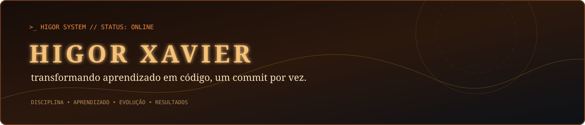

<div align="center">
  
</div>

<div align="center">

`GITHUB: HIGORADS`   `ADS: 2º PERÍODO`   `STATUS: EM EVOLUÇÃO`

</div>

## 👋 Olá, eu sou Higor Xavier

Sou estudante de **Análise e Desenvolvimento de Sistemas**, apaixonado por tecnologia e por transformar ideias em soluções através do código. Estou construindo minha base em desenvolvimento de software com consistência, curiosidade e foco em evolução contínua.

> **Código hoje, mais oportunidades amanhã.**

| 🎯 **Foco** | 📚 **Aprendizado** | 🚀 **Objetivo** |
|:---:|:---:|:---:|
| Fundamentos sólidos | Evolução contínua | Criar soluções úteis |

## 🧰 Tecnologias

```text
┌──────────────────────────────────────────────────────────────┐
│  HTML5   CSS3   Python   Git   GitHub                        │
│  [base web] [estilo] [lógica] [versionamento] [colaboração] │
└──────────────────────────────────────────────────────────────┘
```

### 📖 Aprendendo atualmente

```text
JAVA  ━━━━━━━━━━━━━━━━━━━━━━━  estudando
JS    ━━━━━━━━━━━━━━━━━        construindo base
```

## 📌 Projetos em destaque

### [Academia App](https://github.com/HigorADS/academia-app)
Plataforma de gestão de academia desenvolvida como projeto acadêmico. Uma oportunidade prática para aplicar estrutura de interface, organização de código e desenvolvimento web.

`HTML` `CSS` `DESENVOLVIMENTO WEB`

### [UNINASSAU](https://github.com/HigorADS/UNINASSAU)
Atividade prática com comandos essenciais de Git e GitHub, versionamento e colaboração em projetos.

`GIT` `GITHUB` `DOCUMENTAÇÃO`

## 📊 GitHub em números

```text
REPOSITÓRIOS PÚBLICOS   02
PROJETOS EM DESTAQUE    02
FOCO ATUAL              JAVA + JAVASCRIPT
MODO                    APRENDIZADO CONTÍNUO
```

## 🌱 O que vem pela frente

- Aprofundar meus conhecimentos em **Java** e **JavaScript**
- Evoluir na construção de aplicações completas
- Praticar boas decisões de arquitetura e organização de projetos
- Transformar cada aprendizado em um projeto publicável

## 🤝 Vamos nos conectar?

Estou sempre aberto a conversas sobre tecnologia, aprendizado, oportunidades e novos desafios.

<div align="center">

[**VISITAR MEU GITHUB →**](https://github.com/HigorADS)

`Construído com disciplina, curiosidade e muitas linhas de código.`

</div>

---

<sub>Nota técnica: o GitHub não executa JavaScript/CSS arbitrário dentro de README. Por isso, o banner é um SVG escrito em código, com animações nativas de SVG — grade, scanline, brilho, rotação e cursor pulsante — sem screenshot e sem serviço externo.</sub>
