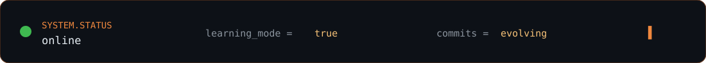
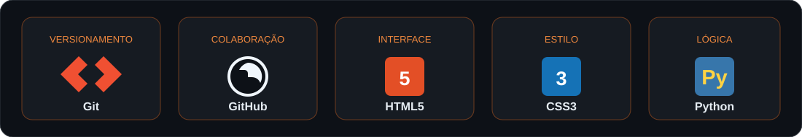
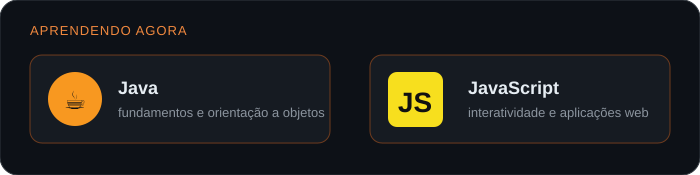

  
    
  

 

  
  
  

## 👋 Olá, eu sou Higor Xavier

Sou estudante de **Análise e Desenvolvimento de Sistemas** e gosto de transformar aprendizado em projetos reais. Estou fortalecendo meus fundamentos, praticando desenvolvimento web e construindo uma base sólida para evoluir como desenvolvedor — um commit por vez.

> **Código hoje, mais oportunidades amanhã.**

<table align="center">
  <tr>
    <td align="center" width="220"><b>🎯 FOCO</b> Fundamentos sólidos</td>
    <td align="center" width="220"><b>📚 APRENDIZADO</b> Evolução contínua</td>
    <td align="center" width="220"><b>🚀 OBJETIVO</b> Criar soluções úteis</td>
  </tr>
</table>

## 🧰 Stack principal

  

## 📖 Aprendendo atualmente

  

## 📌 Projetos selecionados

<table>
  <tr>
    <td width="50%">
      <h3><a href="https://github.com/HigorADS/UNINASSAU">📘 UNINASSAU</a></h3>
      
Atividade prática com comandos essenciais de <b>Git</b> e <b>GitHub</b>, versionamento e documentação.

      
<code>Git</code> <code>GitHub</code> <code>Documentação</code>

    </td>
    <td width="50%">
      <h3><a href="https://github.com/HigorADS/HigorADS">🦊 HigorADS</a></h3>
      
Meu espaço de perfil e portfólio para registrar evolução, estudos e projetos.

      
<code>Profile</code> <code>README</code> <code>Portfólio</code>

    </td>
  </tr>
</table>

## 🌱 Próximos passos

<table>
  <tr>
    <td>☕ Aprofundar Java</td>
    <td>⚡ Evoluir em JavaScript</td>
  </tr>
  <tr>
    <td>🧠 Praticar lógica e organização</td>
    <td>🚀 Publicar novos projetos</td>
  </tr>
</table>

## 🤝 Vamos conversar?

Estou aberto a conversas sobre tecnologia, aprendizado, oportunidades e novos desafios.

  
    
  Construído com disciplina, curiosidade e muitas linhas de código.

